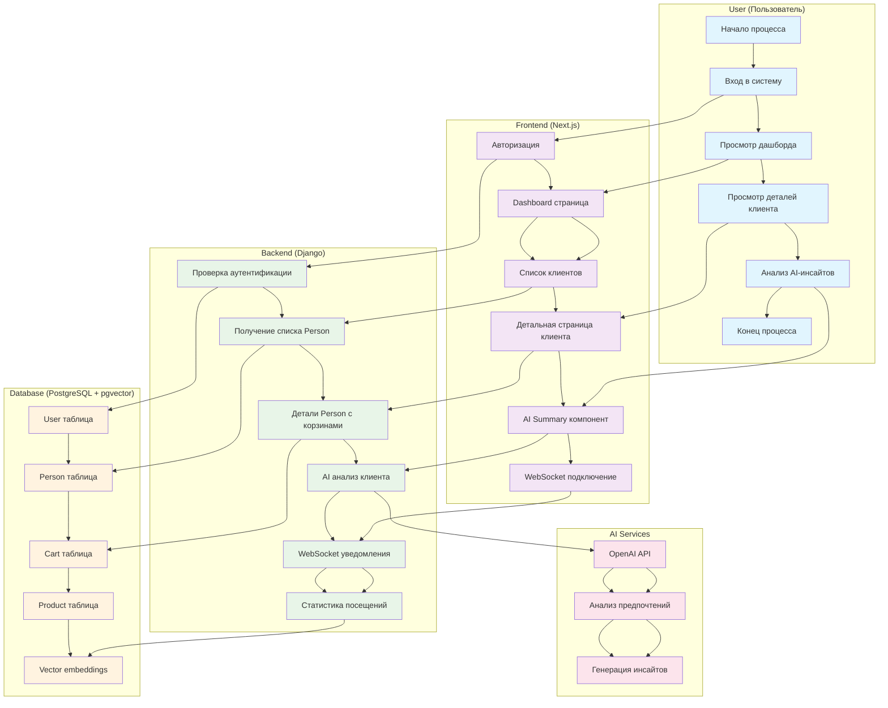
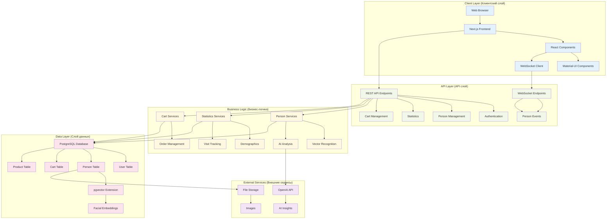
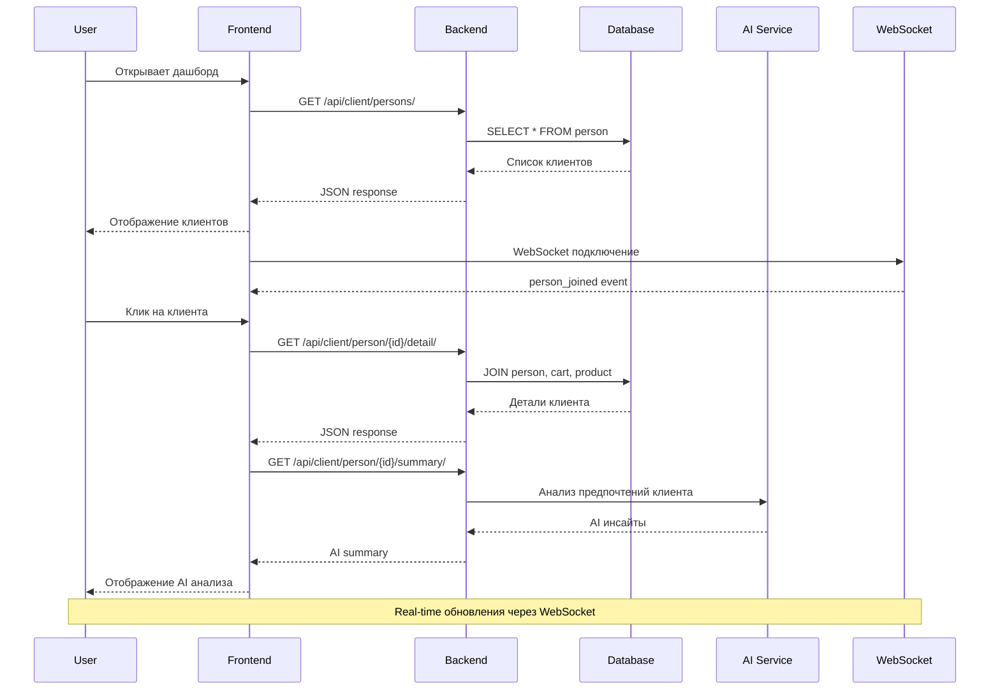

# UML Диаграмма системы Nome.ai

## Диаграмма процесса распознавания лиц и аналитики посетителей



## Диаграмма архитектуры системы



## Детальная диаграмма архитектуры системы


## Диаграмма потока данных для распознавания лиц



## Ключевые компоненты системы

### Frontend (Next.js + React)
- **Dashboard**: Главная страница с карточками клиентов
- **Person Management**: Управление клиентами
- **AI Analytics**: AI-анализ клиентов
- **WebSocket Integration**: Реальное время обновления
- **Material-UI**: Компоненты интерфейса

### Backend (Django + DRF)
- **Person API**: CRUD операции с клиентами
- **Statistics API**: Аналитика посещений
- **Cart API**: Управление корзинами
- **WebSocket**: Уведомления в реальном времени
- **AI Integration**: Интеграция с OpenAI

### Database (PostgreSQL + pgvector)
- **User**: Пользователи системы
- **Person**: Клиенты с векторными данными
- **Cart/Product**: Корзины и товары
- **Vector Search**: Поиск по лицам

### AI Services
- **OpenAI API**: Генерация инсайтов о клиентах
- **Facial Recognition**: Распознавание лиц
- **Behavioral Analysis**: Анализ поведения

## ASCII Диаграмма процесса (как в примере)

```
┌─────────────────────────────────────────────────────────────────────────────────┐
│                           Nome.ai - Система распознавания лиц                   │
└─────────────────────────────────────────────────────────────────────────────────┘

┌─────────────────┐    ┌─────────────────┐    ┌─────────────────┐    ┌─────────────────┐
│   Пользователь  │    │   Frontend      │    │   Backend       │    │   Database      │
│                 │    │   (Next.js)     │    │   (Django)      │    │   (PostgreSQL)  │
└─────────────────┘    └─────────────────┘    └─────────────────┘    └─────────────────┘
         │                        │                        │                        │
         │ 1. Вход в систему      │                        │                        │
         ├───────────────────────►│                        │                        │
         │                        │ 2. Авторизация         │                        │
         │                        ├───────────────────────►│                        │
         │                        │                        │ 3. Проверка User       │
         │                        │                        ├───────────────────────►│
         │                        │                        │                        │
         │ 4. Просмотр дашборда   │                        │                        │
         ├───────────────────────►│                        │                        │
         │                        │ 5. Запрос списка       │                        │
         │                        ├───────────────────────►│                        │
         │                        │                        │ 6. SELECT Person       │
         │                        │                        ├───────────────────────►│
         │                        │                        │                        │
         │ 7. Клик на клиента     │                        │                        │
         ├───────────────────────►│                        │                        │
         │                        │ 8. Детали клиента      │                        │
         │                        ├───────────────────────►│                        │
         │                        │                        │ 9. JOIN с корзинами    │
         │                        │                        ├───────────────────────►│
         │                        │                        │                        │
         │ 10. AI анализ          │                        │                        │
         ├───────────────────────►│                        │                        │
         │                        │ 11. AI Summary         │                        │
         │                        ├───────────────────────►│                        │
         │                        │                        │ 12. OpenAI API         │
         │                        │                        ├───────────────────────►│
         │                        │                        │                        │
         │ 13. WebSocket события  │                        │                        │
         │◄───────────────────────┤                        │                        │
         │                        │◄───────────────────────┤                        │
         │                        │                        │ 14. person_joined      │
         │                        │                        ├───────────────────────►│
         │                        │                        │                        │
┌─────────────────┐    ┌─────────────────┐    ┌─────────────────┐    ┌─────────────────┐
│   AI Services   │    │   WebSocket     │    │   Statistics    │    │   Vector Search │
│   (OpenAI)      │    │   (Real-time)   │    │   (Analytics)   │    │   (pgvector)    │
└─────────────────┘    └─────────────────┘    └─────────────────┘    └─────────────────┘
         ▲                        ▲                        ▲                        ▲
         │                        │                        │                        │
         │ 15. AI инсайты         │                        │                        │
         │◄───────────────────────┤                        │                        │
         │                        │                        │                        │
         │                        │ 16. Real-time updates  │                        │
         │                        │◄───────────────────────┤                        │
         │                        │                        │ 17. Статистика         │
         │                        │                        ├───────────────────────►│
         │                        │                        │                        │ 18. Vector поиск
         │                        │                        │                        ├───────────────────────►│
```

## Диаграмма архитектуры системы

```
┌─────────────────────────────────────────────────────────────────────────────────┐
│                              Nome.ai Architecture                              │
└─────────────────────────────────────────────────────────────────────────────────┘

┌─────────────────────────────────────────────────────────────────────────────────┐
│                              CLIENT LAYER                                      │
│  ┌─────────────┐  ┌─────────────┐  ┌─────────────┐  ┌─────────────┐           │
│  │ Web Browser │  │ Next.js App │  │ React Comp. │  │ Material-UI │           │
│  └─────────────┘  └─────────────┘  └─────────────┘  └─────────────┘           │
│         │                 │                 │                 │                │
│         └─────────────────┼─────────────────┼─────────────────┘                │
│                           │                 │                                  │
│  ┌─────────────┐          │                 │          ┌─────────────┐         │
│  │ WebSocket   │◄─────────┼─────────────────┼─────────►│ API Client  │         │
│  │ Client      │          │                 │          │ (useRequest)│         │
│  └─────────────┘          │                 │          └─────────────┘         │
└─────────────────────────────────────────────────────────────────────────────────┘
                                        │
                                        ▼
┌─────────────────────────────────────────────────────────────────────────────────┐
│                               API LAYER                                        │
│  ┌─────────────┐  ┌─────────────┐  ┌─────────────┐  ┌─────────────┐           │
│  │ REST API    │  │ Auth API    │  │ Person API  │  │ Stats API   │           │
│  │ Endpoints   │  │ Endpoints   │  │ Endpoints   │  │ Endpoints   │           │
│  └─────────────┘  └─────────────┘  └─────────────┘  └─────────────┘           │
│         │                 │                 │                 │                │
│         └─────────────────┼─────────────────┼─────────────────┘                │
│                           │                 │                                  │
│  ┌─────────────┐          │                 │          ┌─────────────┐         │
│  │ WebSocket   │          │                 │          │ Cart API    │         │
│  │ Endpoints   │          │                 │          │ Endpoints   │         │
│  └─────────────┘          │                 │          └─────────────┘         │
└─────────────────────────────────────────────────────────────────────────────────┘
                                        │
                                        ▼
┌─────────────────────────────────────────────────────────────────────────────────┐
│                            BUSINESS LOGIC LAYER                                │
│  ┌─────────────┐  ┌─────────────┐  ┌─────────────┐  ┌─────────────┐           │
│  │ Person      │  │ Vector      │  │ AI Analysis │  │ Statistics  │           │
│  │ Services    │  │ Recognition │  │ Services    │  │ Services    │           │
│  └─────────────┘  └─────────────┘  └─────────────┘  └─────────────┘           │
│         │                 │                 │                 │                │
│         └─────────────────┼─────────────────┼─────────────────┘                │
│                           │                 │                                  │
│  ┌─────────────┐          │                 │          ┌─────────────┐         │
│  │ Cart        │          │                 │          │ Visit       │         │
│  │ Services    │          │                 │          │ Tracking    │         │
│  └─────────────┘          │                 │          └─────────────┘         │
└─────────────────────────────────────────────────────────────────────────────────┘
                                        │
                                        ▼
┌─────────────────────────────────────────────────────────────────────────────────┐
│                              DATA LAYER                                        │
│  ┌─────────────┐  ┌─────────────┐  ┌─────────────┐  ┌─────────────┐           │
│  │ PostgreSQL  │  │ User Table  │  │ Person      │  │ Cart Table  │           │
│  │ Database    │  │             │  │ Table       │  │             │           │
│  └─────────────┘  └─────────────┘  └─────────────┘  └─────────────┘           │
│         │                 │                 │                 │                │
│         └─────────────────┼─────────────────┼─────────────────┘                │
│                           │                 │                                  │
│  ┌─────────────┐          │                 │          ┌─────────────┐         │
│  │ pgvector    │          │                 │          │ Product     │         │
│  │ Extension   │          │                 │          │ Table       │         │
│  └─────────────┘          │                 │          └─────────────┘         │
└─────────────────────────────────────────────────────────────────────────────────┘
                                        │
                                        ▼
┌─────────────────────────────────────────────────────────────────────────────────┐
│                           EXTERNAL SERVICES                                    │
│  ┌─────────────┐  ┌─────────────┐  ┌─────────────┐  ┌─────────────┐           │
│  │ OpenAI API  │  │ AI Insights │  │ File        │  │ Image       │           │
│  │             │  │ Generation  │  │ Storage     │  │ Storage     │           │
│  └─────────────┘  └─────────────┘  └─────────────┘  └─────────────┘           │
└─────────────────────────────────────────────────────────────────────────────────┘
```
